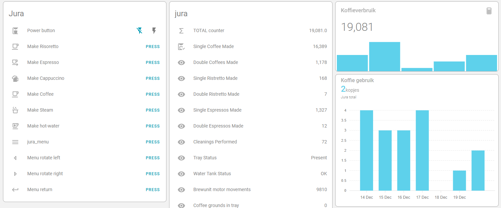

# Jura Impressa F-series UART decoder and ESPHOME controller

This repository is a advanced version of the basic esphome configuration from Rynald Alden. Its tailort for use with a Jura Impressa F7 coffeemachine.
In this repository you will find a lot of additions for this Jura Impressa series. This way we managed to decipher more codes from the UART messages of the jura.

The following counters are now available:

- Single espresso
- Double espresso
- Single Coffee
- Double coffee
- Single cappucino (*)
- Single Ristretto (*)
- Double Ristretto (*)
- Brew-unit movements (*)
- Cleanings
- num of coffee grounds in tray (*)

(*) _all these sensors are new compared to the original esphome interaction by [ryanalden]_

# Hardware connections

Hardware is a Wemos D1 Mini connected to the 7-pin Jura service port via a 3.3V<->5V logic level converter. The D1 mini is powered from the Jura.

Above image taken from [here](https://community.home-assistant.io/t/control-your-jura-coffee-machine/26604).

If you have diffuculty, try swapping the TX/RX pins.

# Home Assistant connection and dashboard

Here is a example of a home-assistant dashboard that you can make with the provided functions and counters:

Here your can find an [example YAML file](../Home-assistant%20dashboard%20example.yaml) from my home-assistant implementation.

# ESPhome webserver examples:

This is a version 2 dashboard example of the integrated webserver from the ESPhome:

----

## reference

Orginal sourcecode is based on:

- [ryanalden]
- <https://community.home-assistant.io/t/control-your-jura-coffee-machine/26604>

[ryanalden]: https://github.com/ryanalden/esphome-jura-component